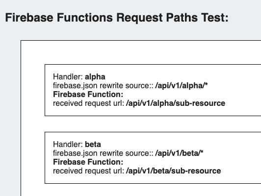
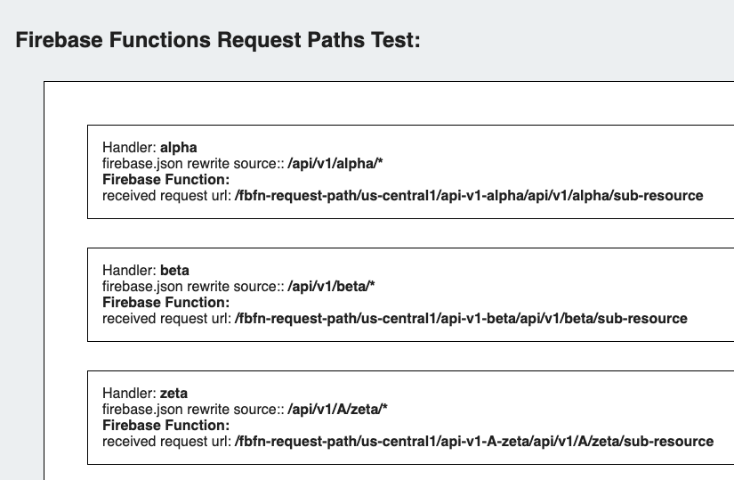

## fbfn-request-path

This project demonstrates the differences in the request path that firebase cloud functions
see when running in the emulator vs a live deployment. The request path in the emulator is
not as expected.

This is problematic for testing cloud functions that are request path sensitive, ones that make use of express or koa routing for example.

The project displays a simple webpage showing the expected and actual request paths received by a set of cloud functions. 

### Running Live:

demo: https://fbfn-request-path.web.app/



### Running in Emulator:




## Example function endpoint results via curl:

These calls were made to the function trigger URL and do not include the `/api/epsilon` that the hosting `rewrite` rule appends. (See [firebase.json](./firebase.json))

### Live:

https://us-central1-fbfn-request-path.cloudfunctions.net/api-epsilon

```json
{
    "handler":"epsilon",
    "expectedPath":"/api/epsilon",
    "requestUrl":"/"
}
```
### Emulator:

```bash
firebase emulators:start
...
i  functions: HTTP trigger initialized at http://localhost:5001/fbfn-request-path/us-central1/api-epsilon`
...
```

```json
{
    "handler":"epsilon",
    "expectedPath":"/api/epsilon",
    "requestUrl":"/fbfn-request-path/us-central1/api-epsilon"
}
```

If the emulator could not prefix the function deployment path with `/[fb-project-id]/[fb-region]/`  or make this available in the environment / config that would be great.
